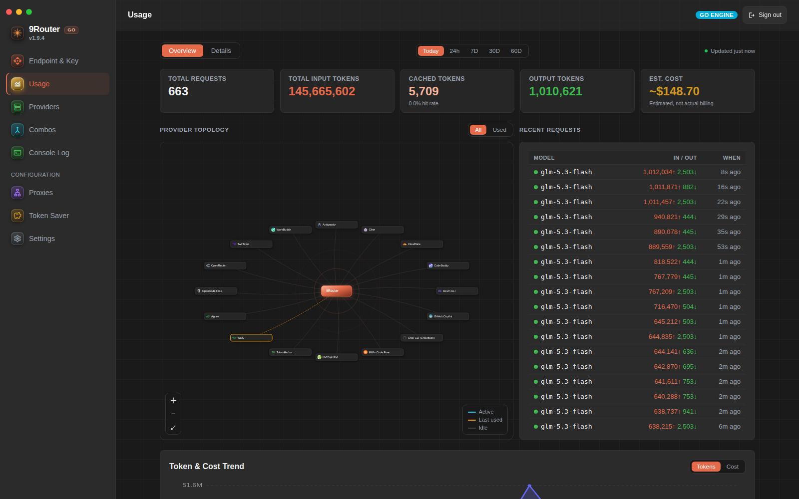
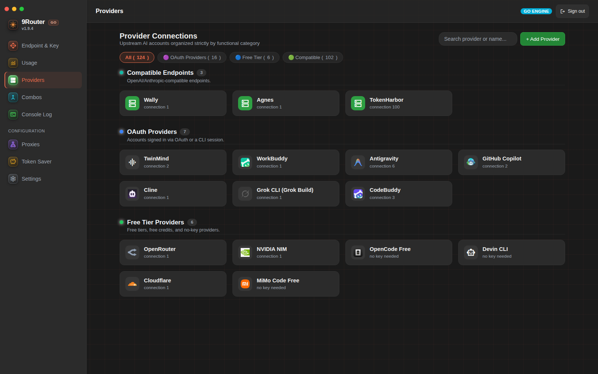

# 9router-go

[](https://github.com/arewedaks/9router-go/actions/workflows/ci.yml)
[](https://github.com/arewedaks/9router-go/actions/workflows/release.yml)
[](https://github.com/arewedaks/9router-go/releases/latest)

A drop-in replacement for the [9Router](https://github.com/decolua/9router) Next.js gateway, rewritten in Go. Same SQLite database, same routing behaviour, dashboard included.

> **v1.9.8** · no CGO · Linux, macOS, Windows

| | Go | Next.js |
|---|---|---|
| Peak throughput | **5,920 RPS** | 505 RPS |
| Memory | **42 MB** | 271 MB |
| Startup | **<100 ms** | 3–5 s |

---

## Quick start

```bash
# install
curl -fsSL https://raw.githubusercontent.com/arewedaks/9router-go/HEAD/scripts/install.sh | bash

# run
9router-go

# open the dashboard, add a provider account
open http://localhost:20128        # xdg-open on Linux, start on Windows
```

Point any OpenAI-compatible client at `http://localhost:20128/v1`:

```bash
curl http://localhost:20128/v1/chat/completions \
  -H "Authorization: Bearer sk-your-api-key" \
  -H "Content-Type: application/json" \
  -d '{"model":"ag/gemini-3.8-flash-high","messages":[{"role":"user","content":"hi"}]}'
```

Claude Code, Cursor, Cline and the rest: **[Client setup](#client-setup)**.

---

## Dashboard

The Go binary serves the full management UI on the same port — no separate Next.js app needed:

| Tab | What you get |
|---|---|
| **Providers** | Add accounts (OAuth flows, API keys, keyless), per-account connection tests, model import from the live upstream catalogue, auto-disable for dead models (Safe/Full modes) |
| **Usage** | Live usage stats, in-flight SSE topology, per-model/per-provider request history |
| **Console Log** | Live SSE log stream with level filters, resource metrics (CPU/RAM/uptime), and the current `/v1/models` count |
| **Token Saver** | RTK compression, Caveman/Headroom/Ponytail toggles with levels |
| **Combos** | Multi-model routing strategies (fallback, round-robin, sticky, fusion) |

### Usage — live stats & topology



### Providers — accounts, connection tests, model import



### Features

**Performance**

- **5,920 RPS** peak throughput (up to 13,216 on native), vs ~500 RPS for Next.js
- **42 MB** memory footprint
- CGO-free, cross-compile to any platform
- **SQLite WAL mode** with non-blocking concurrency (shared with [9Router dashboard](https://github.com/decolua/9router))

**Routing & reliability**

- **Combo strategies**: sticky round-robin, round-robin, fallback, fusion (multi-panel + judge), weight
- **Auto-capability-switch**: floats vision/pdf/audio-capable models to front based on request content
- **Turn & Tool-Calling Stickiness**: locks multi-turn tool calling to the same provider/model to preserve thought signatures
- **Error classification**: text-based error rules + exponential backoff matching Next.js
- **Per-connection model locks**: DB-compatible with Next.js dashboard
- **SSE stall detection**: 6-minute timeout with per-chunk reset
- **Reactive 401 Unauthorized Auto-Refresh**: auto-refreshes OAuth tokens on 401 and retries once before fallback
- **OpenAI, Claude, and Gemini native format support** with bidirectional SSE translation
- **Defer-Lowering Cache Fix**: `LastCacheableToolIndex` untuk MCP `defer_loading:true` tail (#3567)

**Proxy & egress**

- **Dynamic Egress Proxy Pools & Edge Relays**: round-robin IP rotation via active HTTP/HTTPS/SOCKS5 pools + Vercel/Cloudflare/Deno edge relays (`x-relay-target` / `x-relay-path`)
- **No-Auth Provider Proxy Strategies**: automatic proxy pool routing & rotation for free-tier/public providers (`settings.providerStrategies`)
- **SSRF Hardening**: `CGNAT 100.64/10`, `trailing dot`, IPv6 `::ffff:7f00:1` hex, `64:ff9b::`, `normalizeHost`

**Providers & models**

- **Dashboard model import with live catalogues**: Grok CLI (reasoning-effort expansion), TwinMind (`/api/v3/chat/models`), Cline, ClinePass, GitHub Copilot, Antigravity and more — Free/Regular categories, alphabetized, one-click Select-all-free
- **Live auto-disable**: Test-All modes (Safe skips 429/timeouts, Full removes every no-ping) drop dead models per-row the moment their ping fails — no manual refresh
- **Antigravity Tool Cloaking & Anti-Ban Decoy System**: 21 official IDE decoy tools (`run_command`, `replace_file_content`, etc.) with `_ide` suffix cloaking and protobuf validation safeguards
- **Antigravity Anti-Competitive Prompt Stripping**: strips competitor identity prompts to prevent synthetic 429 quota exhaustion errors
- **Gemini 3.8 / 3.7 Flash Model Family**: alias `gemini-3.8-flash-high/medium/low` → `gemini-3.8-flash-tiered` (1M ctx) + `2.11.0` fingerprint, `prefixItems` cleaning
- **Gemini Multimodal Vision & Audio**: base64 inline images, remote `fileData` URLs, `input_audio`, `thoughtSignature` backfill
- **Opencode Muse-Spark 1.2/1.3 + Vision**: `Responses API /v1/responses` routing, `Vision:true`, `oc/` prefix, `reasoning max→xhigh`
- **OpenCode Desktop Fingerprint**: official client headers (`User-Agent: opencode`, `x-opencode-client: desktop`, session/request IDs)
- **Ollama Cloud Web Fetch**: `POST https://ollama.com/api/web_fetch` via `ollama` chat connection API key, `links` + scoped `webfetch:ollama` lock
- **Groq Usage via x-ratelimit***: `GET /openai/v1/models` headers `limit/requests/tokens` + Go duration `2m59.56s` → `ProviderQuotaInfo`
- **Custom Models with Caps Toggle**: `kv customModels` upsert + `SetCustomModelCaps` live refresh, merge di `HandleModels` + `GetCapabilitiesForModel`
- **Single Model Lookup**: `GET /v1/models/*` catch-all `cc/claude-sonnet-4-6` + kind `image/tts/web` (`#3588`)
- **Kimchi Dual Authentication**: seamless API key + OAuth token resolution
- **Dedicated High-Performance Executors**: Qoder COSY signing (RSA-2048 + AES-128 + MD5), CodeBuddy CN/INTL streaming, Trae SOLO remote agent, Windsurf gRPC-web

**Token savers**

- **Token savers**: RTK input compression, Caveman terse output (`lite`, `full`, `ultra`, `wenyan-ultra`), Ponytail minimal-code bias (`lite`, `full`, `ultra`), auto-synced from SQLite `settings` table
- **Headroom Lifecycle Proxy**: token compression proxy management & dashboard reverse proxy

**Observability & ops**

- **Realtime SSE Usage Stream (`/api/usage/stream`)**: in-memory in-flight request tracker powering live glowing pulse & marching-ants animations on the Next.js Usage Topology graph
- **Snake_case Token Limits (`/v1/models` & `/v1/models/info`)**: exposes `context_length`, `max_completion_tokens`, `max_input_tokens`, and `max_output_tokens`, resolved from the synced models.dev catalogue per provider before falling back to name-pattern matching
- **Live Console Logs**: in-process ring buffer + SSE streaming for dashboard console monitoring
- **One-command service install**: `sudo 9router-go service install` writes the systemd unit, enables boot start, verifies it, and starts now

---

## Install

### Option 0: One-line installer (recommended)

Installs the pre-built binary for your OS/arch into `~/.local/bin`, verifies it
runs, and wires up `PATH` — no Go toolchain required:

```bash
curl -fsSL https://raw.githubusercontent.com/arewedaks/9router-go/HEAD/scripts/install.sh | bash
```

Pin a specific version:

```bash
curl -fsSL https://raw.githubusercontent.com/arewedaks/9router-go/HEAD/scripts/install.sh | bash -s -- --version 1.9.8
```

Auto-start on boot (systemd unit + enable, run as root):

```bash
curl -fsSL https://raw.githubusercontent.com/arewedaks/9router-go/HEAD/scripts/install.sh | sudo bash -s -- --service
```

The service can also be managed after install directly through the binary:

```bash
sudo 9router-go service install     # write unit + enable at boot + start now
9router-go service status           # unit installed? running?
sudo 9router-go service uninstall   # stop + disable + remove unit
```

### Option 1: Pre-built binaries
Download the latest binary for your OS and architecture from [GitHub Releases](https://github.com/arewedaks/9router-go/releases/latest):

| Platform | Architecture | Binary |
|----------|--------------|--------|
| **Linux** | x86_64 (`amd64`) | [`9router-go-linux-amd64`](https://github.com/arewedaks/9router-go/releases/latest/download/9router-go-linux-amd64) |
| **Linux** | ARM64 (`arm64`) | [`9router-go-linux-arm64`](https://github.com/arewedaks/9router-go/releases/latest/download/9router-go-linux-arm64) |
| **macOS** | Apple Silicon (`arm64`) | [`9router-go-darwin-arm64`](https://github.com/arewedaks/9router-go/releases/latest/download/9router-go-darwin-arm64) |
| **macOS** | Intel (`amd64`) | [`9router-go-darwin-amd64`](https://github.com/arewedaks/9router-go/releases/latest/download/9router-go-darwin-amd64) |
| **Windows** | x86_64 (`amd64`) | [`9router-go-windows-amd64.exe`](https://github.com/arewedaks/9router-go/releases/latest/download/9router-go-windows-amd64.exe) |

**One-liner download (Linux / macOS):**
```bash
# Detect OS & Arch, download to ./9router-go and make executable
OS=$(uname -s | tr '[:upper:]' '[:lower:]')
ARCH=$(uname -m | sed -e 's/x86_64/amd64/' -e 's/aarch64/arm64/')
curl -sL "https://github.com/arewedaks/9router-go/releases/latest/download/9router-go-${OS}-${ARCH}" -o 9router-go
chmod +x 9router-go
```

### Option 2: Docker

```bash
docker build -t 9router-go . && docker run -d \
  --name 9router-go \
  -p 20128:20128 \
  -v ~/.9router/db:/root/.9router/db \
  9router-go
```

### Option 3: Go install
```bash
go install github.com/arewedaks/9router-go/cmd/9router-go@latest
```

### Option 4: Build from source
```bash
git clone https://github.com/arewedaks/9router-go.git
cd 9router-go
go build -o 9router-go ./cmd/9router-go/
```

---

---

## Running

```bash
# Run with default settings (port 20128, automatically locates ~/.9router/db/data.sqlite)
./9router-go

# Or specify custom port or database path:
PORT=20128 ./9router-go
# or using flags:
./9router-go --port 20128 --db-path ~/.9router/db/data.sqlite

# Verify server health:
curl http://localhost:20128/health
```

### Behind Cloudflare (Tunnel or reverse proxy)

The server speaks plain HTTP and has no TLS of its own, so Cloudflare supplies
it. One click in **Settings → 🌐 Cloudflare / Reverse Proxy → Enable Cloudflare
mode** turns on both the proxy-header trust and the `Secure` cookie flag; only
the socket bind needs a restart (`HOST=127.0.0.1`).

See [CLOUDFLARE.md](CLOUDFLARE.md) for the full walkthrough, verification steps
and troubleshooting. For a from-scratch deployment see [DEPLOY.md](DEPLOY.md).

---

---

## Client setup

9Router-Go provides an **OpenAI-compatible `/v1` endpoint** (plus native Claude `/v1/messages` and Gemini format translation).

### 1. Direct cURL example
```bash
curl http://localhost:20128/v1/chat/completions \
  -H "Content-Type: application/json" \
  -H "Authorization: Bearer sk-your-api-key" \
  -d '{
    "model": "ag/gemini-3.8-flash-high",
    "messages": [{"role": "user", "content": "Hello 9Router!"}],
    "stream": true
  }'
```

### 2. Claude Code CLI
Configure your environment variables to point Claude Code to 9Router:
```bash
export ANTHROPIC_BASE_URL="http://localhost:20128/v1"
export ANTHROPIC_API_KEY="sk-your-key"
claude
```

### 3. Oh My Pi (`omp`)
In `~/.omp/agent/models.yml`:
```yaml
providers:
  myco:
    baseUrl: http://localhost:20128/v1
    apiKey: sk-your-key
    api: openai-completions
```

### 4. Cursor / VS Code / Cline / Continue
- **Base URL**: `http://localhost:20128/v1`
- **API Key**: `sk-your-api-key` (or any string if authentication is public/single-user)
- **Model**: Select any configured model or combo (e.g., `ag/gemini-3.8-flash-high`, `deepseek/deepseek-chat`, combo name).

---

## Routing

How a request picks a provider, and what happens when one fails.

<details>
<summary><b>Combo strategies — fallback, round-robin, sticky, fusion</b></summary>

Combo models support multiple routing strategies, configurable per combo:

| Strategy | Description |
|----------|-------------|
| **fallback** | Try models in order, skip on error (default) |
| **round-robin** | Rotate starting index per request |
| **sticky** | Round-robin with consecutive-use pinning; rotate after `stickyLimit` requests |
| **fusion** | Fire all panel models in parallel → collect with quorum grace → judge synthesizes final answer |

All strategies support **auto-capability-switch**: if the request body contains images or PDFs, capable models (OpenAI, Anthropic, Gemini, etc.) are floated to the front automatically.

#### Fusion

Fusion runs multiple models as a panel in parallel:

1. **Fan-out**: Send request to all panel models simultaneously (non-streaming)
2. **CollectPanel**: Wait for quorum (`minPanel=2`), apply `stragglerGraceMs=8s`, hard timeout at `panelHardTimeoutMs=90s`
3. **Degrade gracefully**: If 0 answers → 503; if 1 answer → answer directly
4. **Judge synthesis**: Build anonymized panel responses → send to judge model → final answer streamed to client

</details>

<details>
<summary><b>Error classification — retry rules and backoff</b></summary>

Errors are classified using the same rule system as Next.js:

| Rule | Type | Action |
|------|------|--------|
| `"no credentials"` | Text | Cooldown 120s |
| `"request not allowed"` | Text | Cooldown 5s |
| `"rate limit"` | Text | Exponential backoff |
| `"too many requests"` | Text | Exponential backoff |
| `"quota exceeded"` | Text | Exponential backoff |
| `"capacity"` / `"overloaded"` | Text | Exponential backoff |
| 401 / 402 / 403 / 404 | Status | Cooldown 120s |
| 429 | Status | Exponential backoff |
| Default (unmatched) | — | Cooldown 30s |

**Exponential backoff**: 2s base, doubled per level, max 5 minutes, 15 levels max.
Backoff level is tracked per-connection in `providerConnections.data.backoffLevel` (DB-compatible with Next.js dashboard).

</details>

<details>
<summary><b>Model locking — per-connection model cooldowns</b></summary>

**Per-connection model locks** — stored as `modelLock_<model>` fields in `providerConnections.data` JSON blob.
Same format as Next.js, readable by the shared dashboard.

- Failed connection → `LockConnectionModel(id, model, duration)` → `data.modelLock_gpt-4 = "ISO timestamp"`
- Successful request → `UnlockConnectionModel(id, model)` → `data.modelLock_gpt-4 = null`, `backoffLevel = 0`
- Connection selection → skips connections with active model lock

</details>

<details>
<summary><b>SSE stall detection — 6-minute timeout</b></summary>

Each SSE stream is wrapped with a `StallReader` (6-minute timeout by default).

- Timer resets on each received chunk
- If timer fires (no data for 6 minutes) → underlying connection is closed → `Read` unblocks with error → stream terminated
- No goroutine leak on clean stream close (timer stopped)

</details>


---

## Token savers

Optional compression that cuts tokens on routed traffic. All four are switchable from the dashboard.

<details>
<summary><b>RTK, Caveman, Ponytail and Headroom — details</b></summary>

Reduce token usage on routed LLM traffic. Each saver is independently toggleable
via CLI flag or environment variable (CLI flag overrides env), and all four are
also editable from the dashboard's **Token Saver** page.

| Saver | CLI flag | Env var | Default | Effect |
|-------|----------|---------|---------|--------|
| RTK | `--rtk` | `RTK_ENABLED` | **on** | Content-aware compression of tool/tool_result messages (git diff, logs, grep, tree) |
| Headroom | — | — | off | Sends the conversation to an external proxy's `/v1/compress` before routing |
| Caveman | `--caveman` | `CAVEMAN_ENABLED` | off | Injects terse-output system prompt (~65% fewer output tokens) |
| Ponytail | `--ponytail` | `PONYTAIL_ENABLED` | off | Injects lazy-senior-dev prompt biasing minimal code |

Caveman and Ponytail each take a level — `lite`, `full` (default) or `ultra` —
set from the Token Saver page. Legacy `light`/`medium`/`compact` values in an
existing database keep working.

Headroom is an optional sidecar. Install and run it from the Token Saver page
(Manage → Start), or point the URL at one you run yourself; an unreachable or
slow proxy costs the request its compression, never its success.

```bash
# All built-in savers on
./9router-go --rtk --caveman --ponytail
```

> RTK is on by default. Disable with `RTK_ENABLED=false` or `--rtk=false`.

#### Per-request bypass

Send `X-9Router-Token-Saver: off` to skip every saver for one request, leaving
the global settings alone:

```bash
curl -H 'X-9Router-Token-Saver: off' http://localhost:20128/v1/chat/completions ...
```

</details>


---

## Architecture

```
┌─────────────────┐     ┌──────────────────────┐     ┌─────────────────┐
│   CLI Client    │────▶│   9router-go binary   │────▶│  Upstream LLM   │
│  (Claude Code,  │     │                       │     │  (OpenAI, etc.) │
│   Codex, etc.)  │     │  • Auth (SQLite)      │     └─────────────────┘
│                 │     │  • Model resolution   │
└─────────────────┘     │  • Combo strategies   │
┌─────────────────┐     │    - sticky           │
│    Browser      │────▶│    - round-robin      │
│  (Dashboard)    │     │    - fallback         │
│  • Providers    │     │    - fusion           │
│  • Usage        │     │  • Auto-capability    │
│  • Console Log  │     │  • SSE streaming      │
│  • Token Saver  │     │  • Stall detection    │
│  • Import       │     │  • Error classification  │
└─────────────────┘     │  • Translation        │
                        └───────┬──────────┘
                                │
                        ┌───────▼──────────┐
                        │  SQLite (WAL)    │
                        └──────────────────┘
```

### Request flow

```
Client → Auth → resolveModel() → [Combo?]
    │                              │
    │ Yes                          │ No
    ▼                              ▼
Combo Handler                 Single Model
    │                              │
    ├─ sticky/round-robin          │
    ├─ fallback                    │
    └─ fusion (parallel panel)     │
    │                              │
    ▼                              ▼
detectRequiredCapabilities()
    │
    ▼
tryForwardWithConnection()
    │
    ├─ Success → unlockModel + logUsage
    └─ Error  → classifyError() → lockConnectionModel()
                                       │
                                  Fallback model?
                                       │ Yes → retry next model
                                       │ No  → error response
```

See [ARCHITECTURE.md](ARCHITECTURE.md) for detailed flow diagrams (combo, fusion, error classification, locking, SSE stall, etc.).

---

## Reference

<details>
<summary><b>API endpoints — full route list</b></summary>

```
# Core Chat & Completion Endpoints
POST /v1/chat/completions      # OpenAI format
POST /v1/messages              # Claude format
POST /v1/messages/count_tokens # Claude token counter
POST /v1/embeddings            # Embeddings
POST /v1/responses             # Responses API
POST /v1/responses/compact     # Compact responses API
POST /api/chat                 # Ollama compatible format

# Media & Multimodal Endpoints
POST /v1/images/generations    # Text-to-image generation
POST /v1/images/understanding  # Image understanding (vision)
POST /v1/videos/generations    # Video generation
POST /v1/videos/edits          # Video edits
POST /v1/videos/extensions     # Video extension
GET  /v1/videos/{id}           # Video status lookup
POST /v1/audio/speech          # Text-to-speech (TTS)
POST /v1/audio/transcriptions  # Speech-to-text (STT)
POST /v1/audio/music           # Music generation
GET  /v1/audio/voices          # TTS voices list

# Search, Scrape & Web Fetch
POST /v1/search                # Web search (provider-selected)
POST /v1/scrape                # Web scrape
POST /v1/web/fetch             # Web URL extraction (Jina Reader / Firecrawl)

# Models & Token Limits
GET  /v1/models                # List models (with context_length, token limits)
GET  /v1/models/info           # Model capability & limits metadata
GET  /v1/models/{kind}         # Models filtered by kind (e.g. tts, image)

# Usage & Realtime SSE Stream
GET  /api/usage/stream         # Live SSE in-flight request tracking & topology animation
GET  /api/usage/stats          # Realtime usage stats & active concurrency

# OAuth & Authentication
POST /v1/oauth/authorize       # OAuth authorize
POST /v1/oauth/refresh         # OAuth refresh

# System & Monitoring
GET  /health                   # Health check
GET  /api/version              # Proxy version & update check
GET  /api/translator/stream    # Dashboard live console log SSE stream
```

</details>

<details>
<summary><b>Environment variables</b></summary>

| Variable | Default | Description |
|----------|---------|-------------|
| `PORT` | `20128` | Server port |
| `DATA_DIR` | `~/.9router/` | Data directory (DB, JWT secret) |
| `DB_PATH` | `DATA_DIR/db/data.sqlite` | Custom SQLite DB path (overrides DATA_DIR) |
| `LOG_FILE` | stderr | Log output file (defaults to stderr when unset) |
| `RTK_ENABLED` | `true` | Enable RTK input compression |
| `CAVEMAN_ENABLED` | `false` | Enable Caveman terse output style |
| `PONYTAIL_ENABLED` | `false` | Enable Ponytail minimal-code bias |

</details>

<details>
<summary><b>Database — schema and file layout</b></summary>

Uses the same SQLite DB as [9Router dashboard](https://github.com/decolua/9router) (`~/.9router/db/data.sqlite`) with WAL mode.

**Tables:** `apiKeys`, `providerConnections`, `providerNodes`, `combos`, `kv`, `settings`, `usageHistory`, `usageDaily`, `requestDetails`, `proxyPools`, `_meta`

See [DATABASE.md](DATABASE.md) for full schema documentation, JSON blob structure, and Go vs Next.js differences.

#### Custom DB location

```bash
# Use custom SQLite path
DB_PATH=/mnt/shared/9router/data.sqlite PORT=20128 ./9router-go
```

</details>

<details>
<summary><b>Docker — image and compose</b></summary>

#### Build the image locally

```bash
docker build -t 9router-go .
```

#### Docker Compose (`docker-compose.yml`)

The repo's compose file builds the image from source and mounts a named volume
for the SQLite data dir:

```yaml
services:
  9router-go:
    build: .
    container_name: 9router-go
    ports:
      - "20128:20128"
    volumes:
      - 9router-data:/data
    environment:
      - PORT=20128
      - DATA_DIR=/data
      # Token saver toggles (all default off except RTK):
      # - RTK_ENABLED=true
      # - CAVEMAN_ENABLED=false
      # - PONYTAIL_ENABLED=false
      # Or use DB_PATH for a custom SQLite location:
      # - DB_PATH=/data/custom/data.sqlite
    restart: unless-stopped

volumes:
  9router-data:
```

```bash
docker compose up -d
```

</details>

<details>
<summary><b>Cross-compile</b></summary>

```bash
GOOS=linux GOARCH=amd64 go build -o 9router-go-linux ./cmd/9router-go/
GOOS=darwin GOARCH=arm64 go build -o 9router-go-mac ./cmd/9router-go/
GOOS=windows GOARCH=amd64 go build -o 9router-go.exe ./cmd/9router-go/
```

</details>

<details>
<summary><b>Test</b></summary>

```bash
go test ./... -v
```

Run with `-count=1` to bypass test caching.

</details>

<details>
<summary><b>Benchmark — numbers and methodology</b></summary>

Run the native self-contained Go benchmark runner (zero external dependencies):

```bash
go run ./benchmark/runner.go
```

| Metric | Go Proxy | Legacy Next.js | Speedup |
|---|---|---|---|
| Peak RPS (non-stream) | 5,920 (up to 13,216 native) | 505 | **11.7x – 26x** |
| Peak RPS (stream) | 5,437 | 429 | **12.6x** |
| Avg latency (c=100) | 6.0ms | 108ms | **18x** |
| Memory (RSS) | 42.5 MB | 270.9 MB | **6.4x lighter** |
| Startup | <100ms | 3–5s | **30–50x** |

See [`benchmark/RESULTS.md`](benchmark/RESULTS.md) for full methodology and reproduction steps.

</details>


---

## Roadmap

See [`ROADMAP.md`](ROADMAP.md) for planned future features, cost-aware model routing, semantic caching, and alerting proposals.

## Credits

- [9Router](https://github.com/decolua/9router) — Original Next.js LLM routing gateway + dashboard
